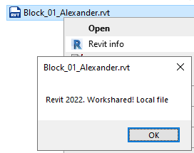

# ShowRevitVersion

This simple application displays the Revit file version without opening the file, simply by right-clicking.

RVT and RFA files are supported.

For RVT files, information about "Worksharing" is also displayed if enabled.



## Installation

Run **`ShowRevitVersionSetup.exe`** — no admin rights required.

The installer will:
- Copy `ShowRevitVersion.exe` to `%LOCALAPPDATA%\ShowRevitVersion\`
- Register the right-click context menu for `.rvt` and `.rfa` files
- Add the app to the **"Open with"** list, visible in the Windows 11 modern context menu

The menu label is automatically displayed in the user's Windows language (English, French, German, Spanish, Italian, Portuguese, Dutch, Polish, Russian, Japanese, Chinese).

To uninstall, run:
```
ShowRevitVersionSetup.exe /uninstall
```

## Usage

- **Right-click** any `.rvt` or `.rfa` file in Explorer and select the menu entry
- Or **double-click** `ShowRevitVersion.exe` to open a file picker
- Or pass one or more file paths as arguments:
  ```
  ShowRevitVersion.exe file1.rvt file2.rvt
  ```

## How the version is read

- **RFA files** — reads the file as text and searches for the XML attribute `<product-version>`
- **RVT files** — opens the file as an OLE compound document using the [OpenMcdf](https://github.com/ironfede/openmcdf) library and reads the `BasicFileInfo` stream

## Requirements

- Windows 10 / 11
- .NET Framework 4.7 (installed automatically with Revit)

## Technical notes

All dependencies are bundled inside the exe — no additional DLLs needed.

2026, Alexandr Zuyev
License: MIT
